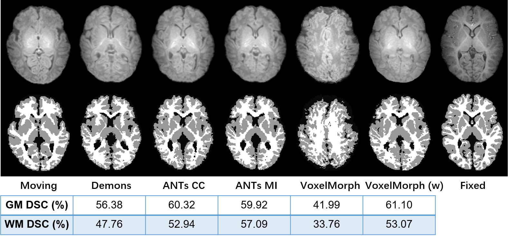
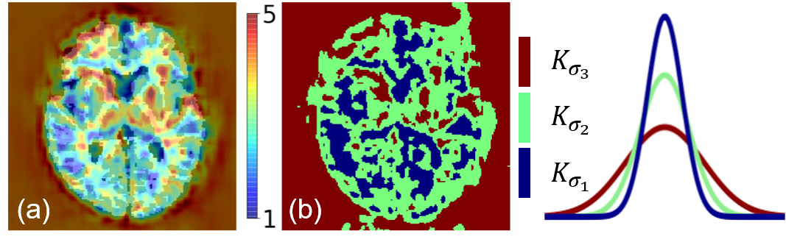
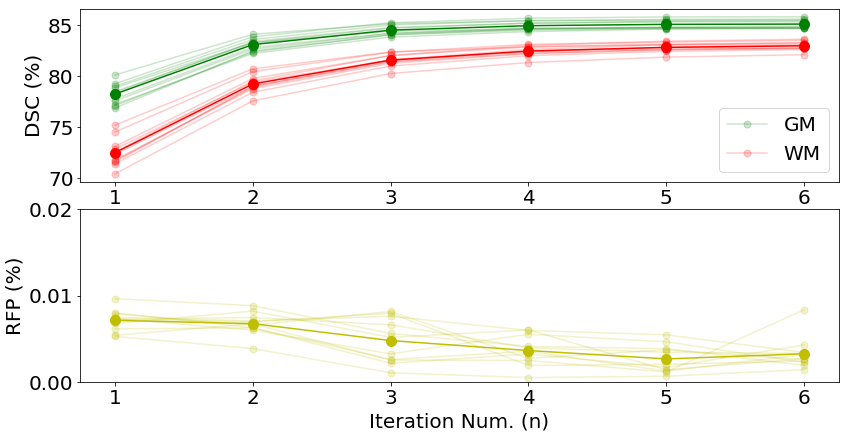
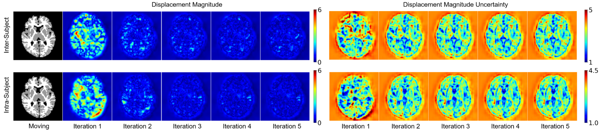

# Recurrent Tissue-Aware Network for Deformable Registration of Infant Brain MR Images
Code review processing. Welcome for any bug report!

## Background
Infant brain image registration is crucial for longitudinal and population-based analysis. It can help study early brain development during infancy, often with
dynamic volumetric and morphometric changes. While deformable image registration serves as an important tool to quantify these changes, the rapid brain
development during infancy makes the task challenging. Someone may have concern about using the intensity images directly for infant brain MR image registration. Here,
we have validated the traditional registration methods like Demons and ANTs, and deep-learning-based VoxelMorph to register intensity images directly.



  * If you use ACTA-Reg-Net, please cite:
    
    **Recurrent Tissue-Aware Network for Deformable Registration of Infant Brain MR Images**   
    Dongming Wei, Sahar Ahmad, Yuyu Guo, Liyun Chen, Yunzhi Huang, Lei Ma, Zhengwang Wu, Gang Li, Li Wang, Weili Lin, Pew-Thian Yap, Dinggang Shen, Qian Wang\
    [IEEE Transactions on Medical Imaging](https://ieeexplore.ieee.org/document/9656924)

    **An Auto-Context Deformable Registration Network for Infant Brain MRI**    
    Dongming Wei, Sahar Ahmad, Yunzhi Huang, Lei Ma, Zhengwang Wu, Gang Li, Li Wang, Qian Wang, Pew-Thian Yap, Dinggang Shen\  
    [eprint arXiv:2005.09230](https://arxiv.org/abs/2005.09230)

## Instruction





This code is for registering infant brain MR images. The registration is based on the segmentation map (gray matter, white matter). You can try to modify the directory in train.py to train your model. Or you can directly use test.py to test your data, where a trained model is given in ./models.

 * For obtaining an ACTA-Reg-Net, you need to work on ./src/demo.sh to run all the experiments.

## Requirements
- Python 3.6 (3.7 should work well)
- Tensorflow 1.10 (any 1.xx version should work well)
- Keras 2.2.4
- Bash

You can choose to run
```bash
pip install -r requirements.txt
```
Or you can perform
```bash
conda create -n tf10-py36 python=3.6
conda activate tf10-py36
conda install tensorflow-gpu==1.10
```
## Train
```bash
python train.py
```
For training your dataset, you need to modify the data directory in the trian.py. For our task, we save the infant brian images into the ../data/MAPS_DATASET/Train_Set. 
After this step, you have obtained your Reg-Net, which is supposed to generate smooth deformation fields. Then, you can execute the demo.sh to perform an 'auto-context' manner to boost the registration performance.

## Test for the single TA-Net
```bash
python test.py gpu_id ../models/ iteration_num fixed.nii.gz moving.nii.gz moving_label.nii.gz
```

## Demo for RTA-Net
```bash
cd ./src
./demo.sh -m moving.nii.gz -l moving_label.nii.gz -n save_dir -f fixed.nii.gz
```
The results are saved into ../data/results/*, including the warped moving image, moving label, deformation field, and displacement uncertainty map.

## Result


## Iteration Analysis




# Acknowledgement:
We would like to acknowledge the contribution of [VoxelMorph](https://github.com/voxelmorph/voxelmorph).


# Contact:
For any problems, please open an [issue](https://github.com/Barnonewdm/ACTA-Reg-Net/issues/new).


