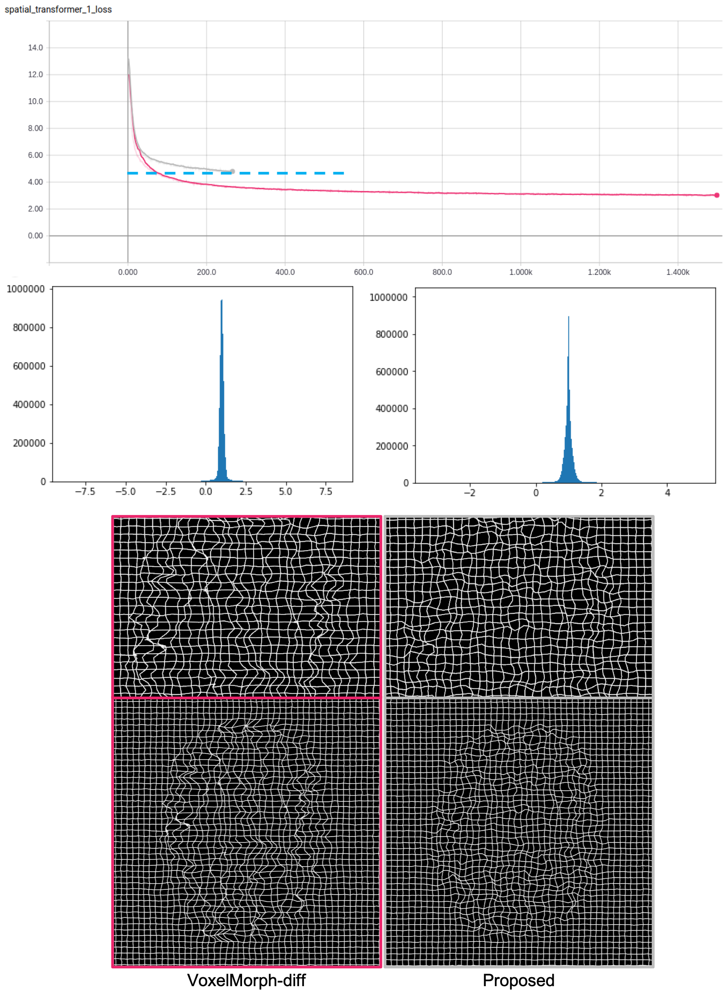

# ATReg 
Coming soon! Code review processing.
## Instruction


## Requriement
- Tensorflow

## Train
```bash
python train.py
```

## Test
```bash
python test.py
```

## Demo
```bash
./demo.sh -m moving.nii.gz -l moving_label.nii.gz -n save_dir
```
## Result


